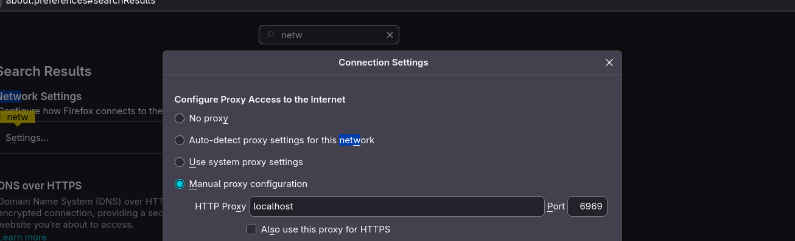
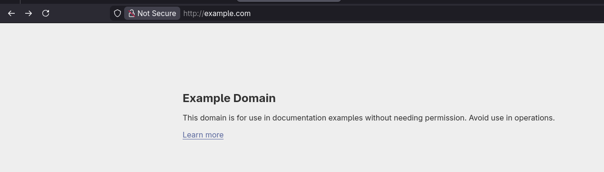
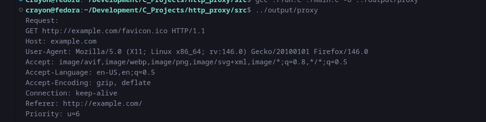

# Minimal HTTP Proxy

A minimal HTTP proxy written in C.

The proxy listens locally, accepts HTTP requests from a browser or client, forwards them to the target server on port 80, and relays the response back unchanged.

---

## How it works

Browser -> Proxy -> Server
Browser <- Proxy <- Server

The proxy sits between a client and a server and forwards data between the two connections.

---

## Behavior

- Listens on `localhost:6969`
- Accepts a single client connection
- Reads one HTTP request
- Extracts the `Host` header
- Connects to the target server on port 80
- Forwards the request
- Relays the server response back to the client
- Closes the connections

---

## Build Instructions

Compile all `.c` files in the `src/` directory.
and after execution the proxy listens on localhost:6969

configure firefox's proxy network settings manually to test it out

## Screenshots

Firefox HTTP proxy configuration:

Example page loaded through the proxy:

HTTP request logged by the proxy:

gcc src/*.c -o proxy

